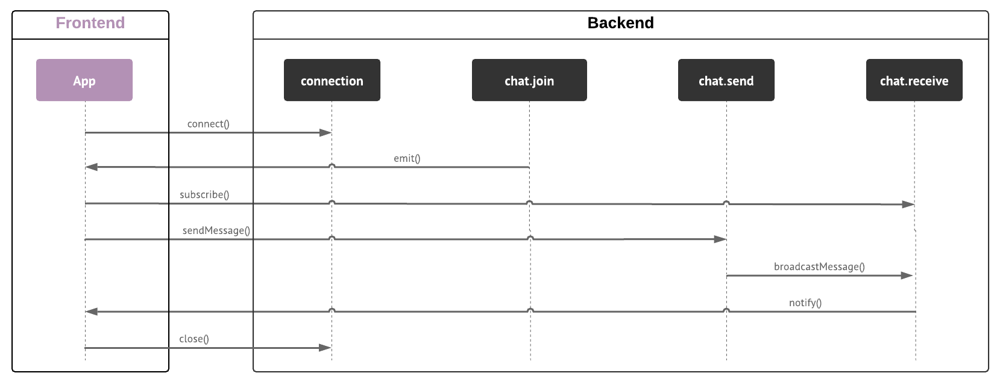

# Chat App
This is a real-time chat application built with [Node.js](https://nodejs.org/en/) and [React.js](https://reactjs.org/).

## Author
Guilherme Santos <sntguilherme@gmail.com>

## Requirements
Please make sure you have the following items installed on your environment, they are necessary to execute the application.

### Have git installed
You need [git](https://git-scm.com) installed in your environment, you can check if you have git installed by running the following command:

```sh
git --version
```

If you don't have it installed, go to the [download page](https://git-scm.com/downloads) and follow the instructions for installation.

### Have version 13.5.0 or + of Node.js installed
You need the `v13.5.0+` of [Node.js](https://nodejs.org/) installed in your environment, you can check if you have git installed by running the following command:

```sh
node --version
```

If you don't have it installed, go to the [download page](https://nodejs.org/) and follow the instructions for installation.

### Have yarn installed
This project uses `yarn` as its task runner and, although not a rule, it's recommended that you use it.
To install it, execute the following script on the terminal:

```sh
npm install --global yarn
```

## Modules
This application has two modules in the same repository: [backend](backend) and [frontend](frontend).

In the directory of each module, there is a more detailed documentation of each one.

### Folder structure
This is what each folder correlates to:

```
chat
├── backend/         # Module with the application backend server
└── frontend/        # Module with the application's frontend layer (SPA)
```

### How they work
When the frontend application starts from the browser, a request to connect on the WebSocket server is sent.
Right after this request, the client subscribes to a channel (`chat.join`) to be notified when the connection request is successfully completed.

When making the connection, the server sends a message to the channel (`chat.join`) of the client application with the connection identifier which is also used as the user's identifier.

After that, the client application subscribes to the channel (`chat.receive`) of messages received from the chat.

When a chat message is sent on the client, a WebSocket message is sent to the server's (`chat.send`) channel.
The server then processes this message, creates a unique identifier for it and also adds some more necessary information such as the author's identifier and the DateTime of the message.
After that, the server broadcasts the message to all connected clients, making the message visible on all clients, including the author.

The server doesn't store the messages sent, it only processes and resends them to all clients with an active connection.

Differentiation of messages received and sent happens only on the client, making it possible to display which messages are from the author and which are not.

When the application is being closed, a connection cancellation request is sent to the server by the client.

The image below illustrates the flow of messages and notifications that occurs between the client and the server.



### References

Here is the list of the links used to design this solution:
- https://github.com/kuy/redux-saga-chat-example
- https://github.com/ganeshmani/reduxsaga-socket
- https://github.com/justadudewhohacks/websocket-chat
- https://github.com/saibot777/redux-saga-socketIO-chat-app
- https://dev.to/mihailgaberov/how-to-build-a-chat-app-with-react-typescript-and-socket-io-2e1c
- https://www.freecodecamp.org/news/how-to-build-a-chat-application-using-react-redux-redux-saga-and-web-sockets-47423e4bc21a/
- https://mihail-gaberov.eu/how-i-built-chat-app-with-react-and-typescript-part3/
- https://medium.com/@otaviobn/como-usar-websockets-com-o-redux-saga-9db41ee033e6

And the documentation from the libraries used was also used.
